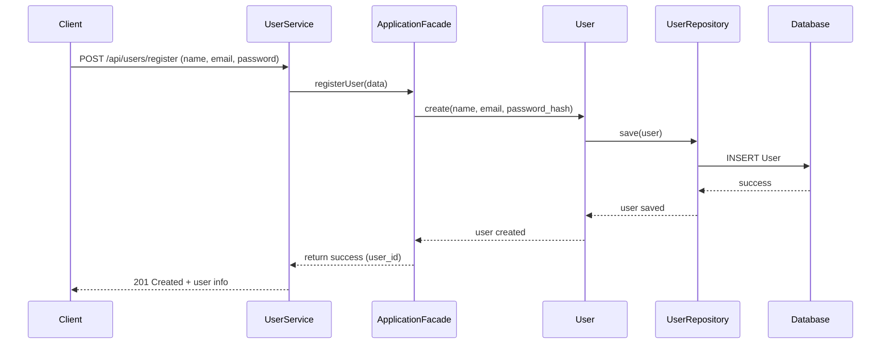
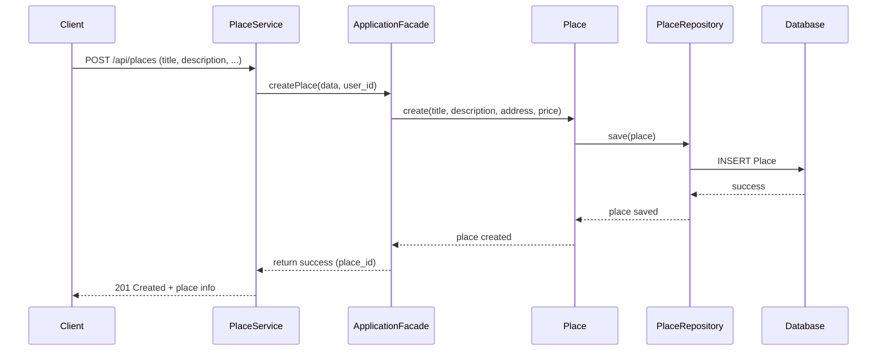
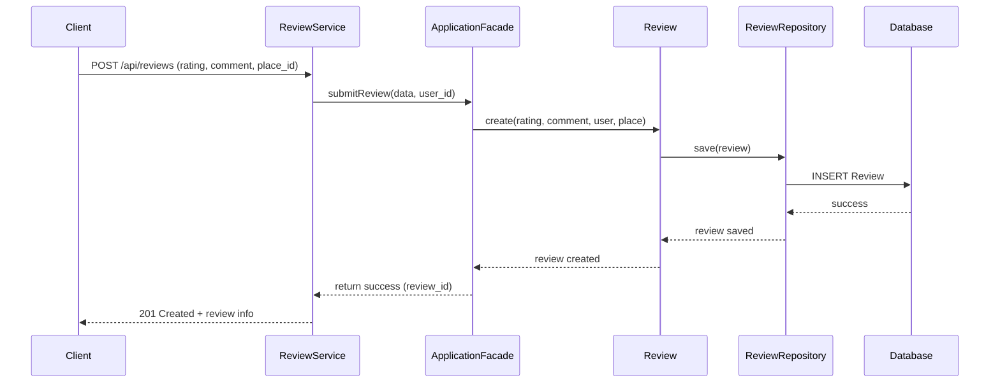
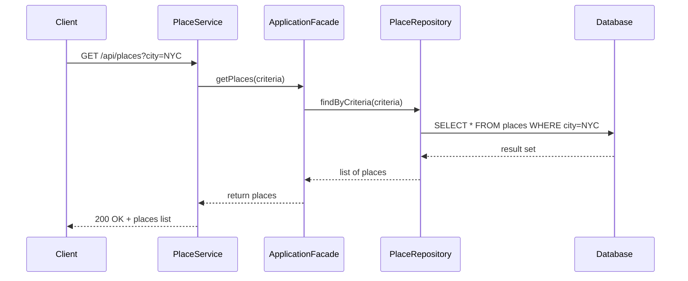

# Sequence Diagrams for API Calls
## User Registration

Purpose: Allow a new user to sign up.

Flow: The client sends signup data → UserService validates and calls the ApplicationFacade → a User entity is created → persisted via UserRepository → stored in the database → success returned.

Key Contribution of Layers:

Presentation: Accepts API request, forwards to business logic.

Business Logic: Creates user entity, applies rules.

Persistence: Saves user in DB.
##
## Place Creation

Purpose: A registered user creates a new listing.

Flow: Client sends place data → PlaceService forwards to ApplicationFacade → a Place entity is created → persisted in PlaceRepository → saved in DB → success returned with place ID.

Layer Roles:

Presentation: Handles API request.

Business Logic: Validates ownership, builds place entity.

Persistence: Saves listing in DB.
##
## Review Submission

Purpose: Users can review places.

Flow: Client submits review → ReviewService → ApplicationFacade creates Review entity linked to User and Place → ReviewRepository saves it → DB insert → success returned.

Layer Roles:

Presentation: Collects input from user.

Business Logic: Applies rules (e.g., rating must be 1–5).

Persistence: Stores review in DB.
##
## Fetching a List of Places

Purpose: Users query available places by criteria (e.g., city).

Flow: Client requests list → PlaceService → ApplicationFacade → PlaceRepository queries DB → results returned back through layers.

Layer Roles:

Presentation: API endpoint handling.

Business Logic: Delegates query, might apply filters/rules.

Persistence: Executes query against DB and returns results.
