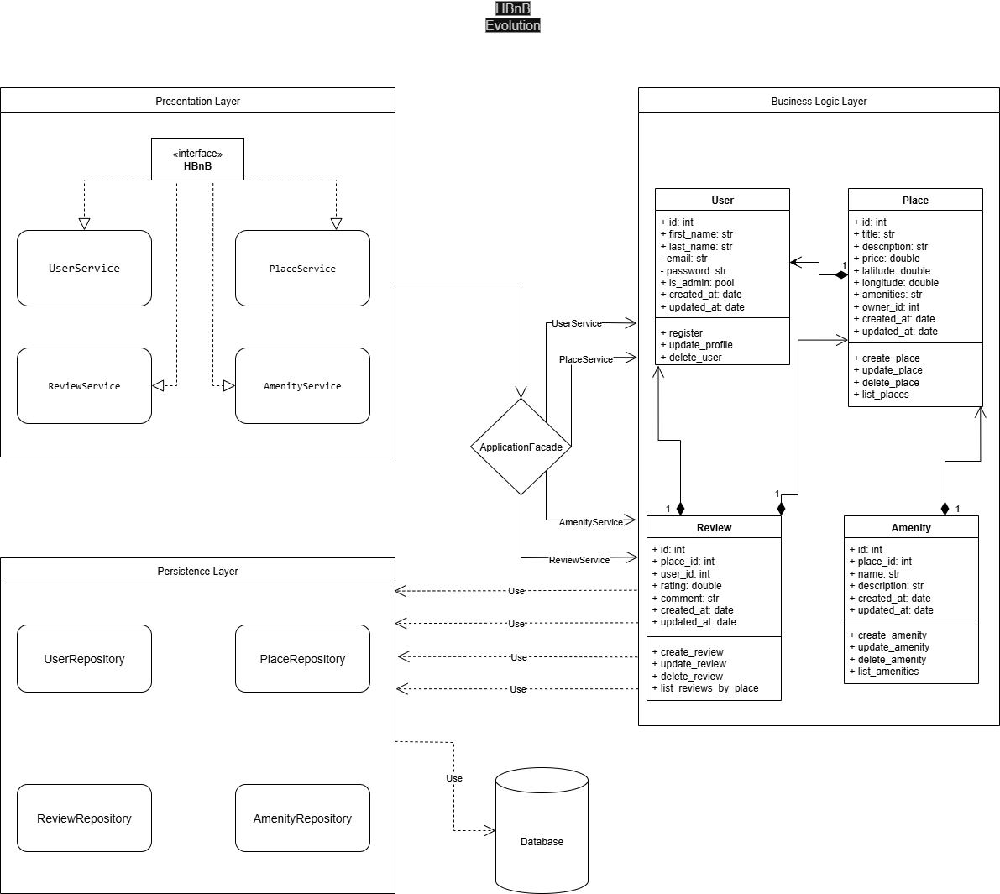
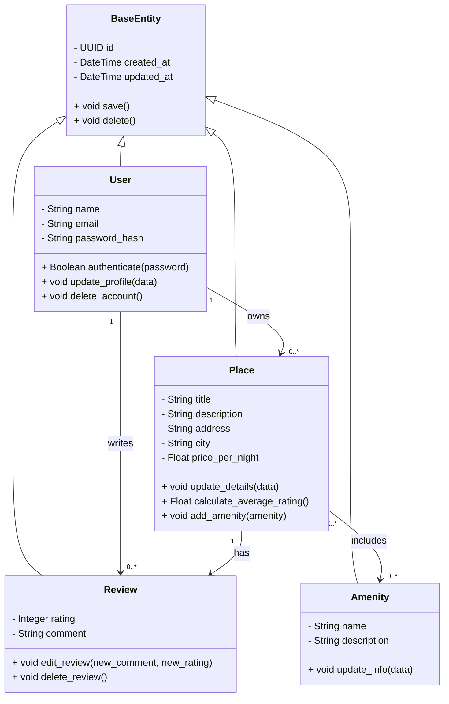
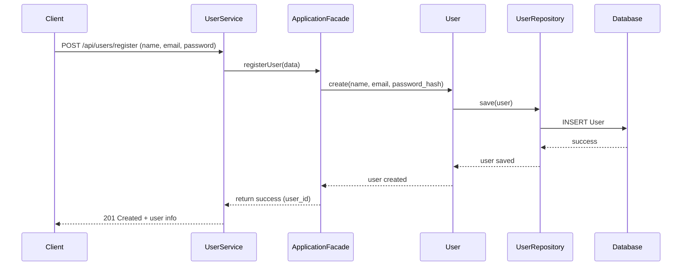
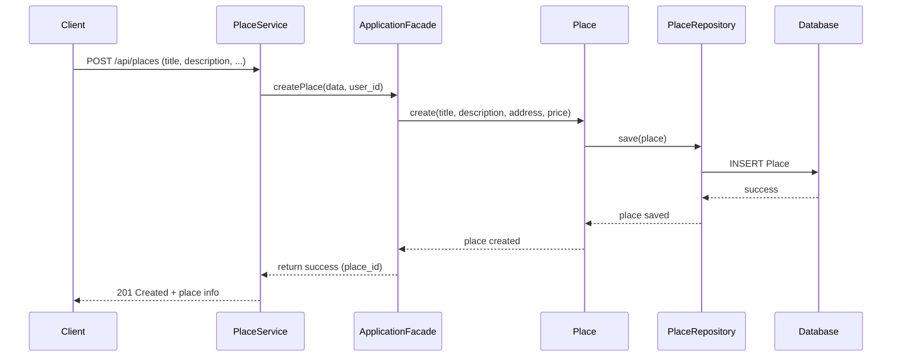
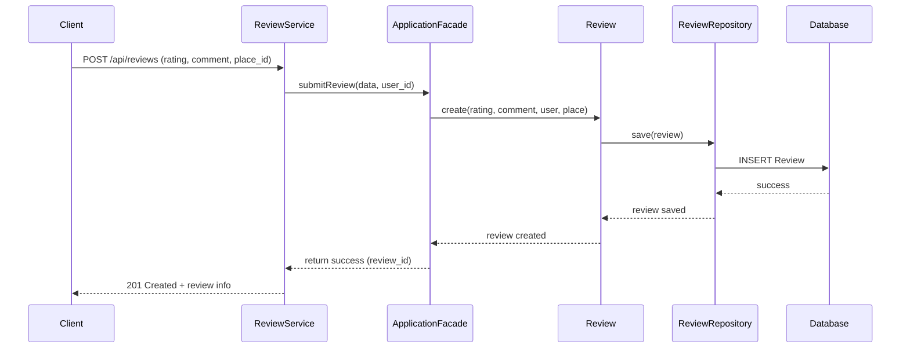
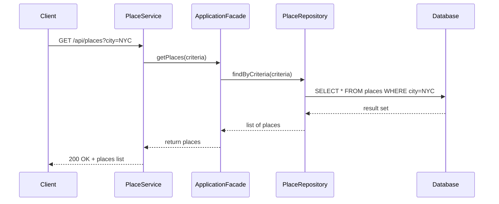

# HBnB Project – Technical Architecture & Design Document

## Introduction
The HBnB project is a web-based platform designed to replicate and extend functionalities similar to Airbnb.  
This document consolidates all architecture and design artifacts created in earlier tasks into a comprehensive technical reference.  

**Purpose of this document**:
- Serve as a blueprint for the implementation phases of the HBnB project.  
- Provide clarity on system architecture, business logic, and API interactions.  
- Ensure consistency and accuracy across all development efforts.  

**Scope**:  
The document includes high-level architecture diagrams, detailed class diagrams for the business logic layer, and sequence diagrams for API interactions, along with explanatory notes for each.

---

## High-Level Architecture

### Package Diagram

Explanation

Layered Architecture: The system is divided into distinct layers (UI, API, Business Logic, Data) to enforce separation of concerns.

Facade Pattern: The API acts as a facade, exposing simplified endpoints for client interactions while hiding internal complexities.

Scalability: This design supports modular expansion and easier maintenance.
##
## Business Logic Layer
Class Diagram

Explanation

Entities:

User: Represents application users with authentication logic.

Place: Represents listings, including attributes like location and pricing.

Reservation: Represents bookings tied to users and places.

Relationships:

A User can make many Reservations.

A Reservation is tied to exactly one Place.

Design Decisions: Normalized structure to ensure clear ownership and data integrity.
##
## API Interaction Flow
Sequence Diagrams
## User Registration

##
## Place Creation

##
## Review Submission

##
## Fetching a List of Places

Explanation

Flow:

User sends a reservation request.

API validates and forwards it to the Business Logic Layer.

Business Logic interacts with the database to create the reservation.

The response flows back through the API to the user.

Design Decision: The API gateway enforces validation and authentication, ensuring that the business layer only processes valid requests.

## Conclusion

This document consolidates HBnB’s system design into a single reference.
It provides a clear overview of the system’s layered architecture, detailed insights into the business logic classes, and interaction flows for API calls.

By following this blueprint, the development team can ensure consistency, scalability, and maintainability throughout the project lifecycle.
## Authors

- **Rayan Hantoul** [Rayan ](https://github.com/Ry-88)
- **Mohammed Alayda** [Mohammed](https://github.com/moha88z)
- **Raed Alqabas** [Raed](https://github.com/Raed-Alqabas)